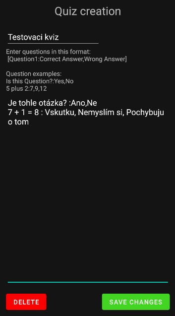
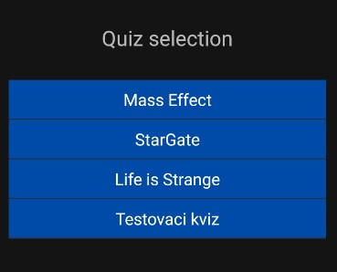
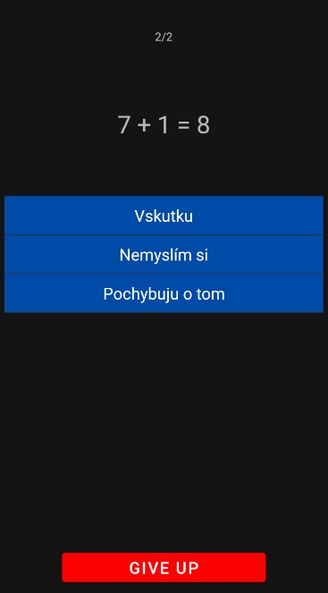

# Qazpp
## Funkce
### Správa kvízů
- Vytváření nových
- Editace a mazání existujících
- Resetování
    - Smazání všech kvízů
    - Obnovení předpřipravených kvízů
  

### Vyplňování
- Otázky i odpovědi jsou náhodně proházené
- Možnost ukončení kvízu předčasně

### Vyhodnocování
- Splněný kvíz je na konci vyhodnocen
- Každá otázka = 1 správná odpověd
- Počet možných otázek a odpovědí na ně teoreticky nemomezený

